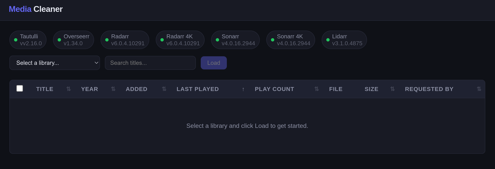

# Media Cleaner

**Version 1.6.0** — A web app that shows your Tautulli library sorted by last played and lets you bulk-remove items from **Seerr**, **Radarr**, **Sonarr**, and **Lidarr** in one click. After removal, the app can trigger a **Plex** library refresh and a **Tautulli** media info refresh so changes appear in both.

## Screenshot

<p align="center">
  
</p>

## What it does

1. Pulls library media from **Tautulli**, sorted by last played (oldest first)
2. Click any column header to sort by title, year, added date, last played, play count, size, or requested by
3. Shows the **Seerr requestor** for each item when available
4. Select one or more items and hit **Remove Selected**
5. For each item the app will:
   - Remove the request and clear media data in **Seerr**
   - Delete the movie/show/artist (and files on disk) from all configured **Radarr**, **Sonarr**, or **Lidarr** instances
6. After all selected items are removed from the *arrs, the app will:
   - Trigger a **Plex** library refresh for affected sections (optional; requires `PLEX_URL` and `PLEX_TOKEN`)
   - Wait 20 seconds, then trigger a **Tautulli** media info refresh so Tautulli’s cache reflects Plex’s changes
   - Reload the page so the library list is up to date

**Note:** Items removed from Radarr/Sonarr/Lidarr will still appear in **Tautulli** until Plex has scanned and Tautulli has refreshed. The app triggers both automatically when Plex is configured.

**Tautulli “calculating file sizes”:** When Tautulli is calculating file sizes for a library (e.g. after a refresh), **the data shown in the app may not be up to date**. A yellow alert banner at the top of the page appears when the app detects this state. File sizes and other fields may be missing or stale until Tautulli finishes. You can still use the app; consider reloading after Tautulli has finished calculating.

**TV shows:** When removing TV shows from Sonarr, Tautulli’s media info refresh can take several minutes because it rescans the entire TV show library and all episodes. The app shows a warning in the toast and reloads the page after the refresh is triggered; the update may not appear in Tautulli’s own UI until the scan completes.

Items whose Plex metadata can no longer be resolved (e.g. removed from Plex but still cached in Tautulli) will have the Seerr and *arr steps gracefully skipped.

## Setup

```bash
cd cleaner

python3 -m venv venv
source venv/bin/activate

pip install -r requirements.txt

cp .env.example .env
# Edit .env with your API keys and URLs
```

### Environment variables

| Variable | Description |
|---|---|
| `DEBUG` | Set to `true` for development (Flask dev server, `/api/debug` routes enabled). Default `false` (production WSGI). |
| `STAT` | Set to `true` to enable the `/api/status` connectivity endpoint. Default `true`. |
| `TAUTULLI_URL` | Tautulli base URL (e.g. `http://localhost:8181`) |
| `TAUTULLI_API_KEY` | Tautulli API key (Settings > Web Interface) |
| `PLEX_URL` | Plex Media Server URL (e.g. `http://localhost:32400`). Optional — used to refresh library after Radarr deletes files. |
| `PLEX_TOKEN` | Plex Media Server API token (X-Plex-Token). Optional; leave blank to skip Plex refresh. **This is the local server token, not your Plex.tv account token.** See below for how to get it. |
| `OVERSEERR_URL` | Seerr base URL (e.g. `http://localhost:5055`) |
| `OVERSEERR_API_KEY` | Seerr API key (Settings > General) |
| `RADARR_1_URL` | Primary Radarr base URL |
| `RADARR_1_API_KEY` | Primary Radarr API key |
| `RADARR_1_NAME` | Display name (e.g. `Radarr`) |
| `RADARR_2_URL` | Secondary Radarr base URL (leave blank to disable) |
| `RADARR_2_API_KEY` | Secondary Radarr API key |
| `RADARR_2_NAME` | Display name (e.g. `Radarr 4K`) |
| `SONARR_1_URL` | Primary Sonarr base URL |
| `SONARR_1_API_KEY` | Primary Sonarr API key |
| `SONARR_1_NAME` | Display name (e.g. `Sonarr`) |
| `SONARR_2_URL` | Secondary Sonarr base URL (leave blank to disable) |
| `SONARR_2_API_KEY` | Secondary Sonarr API key |
| `SONARR_2_NAME` | Display name (e.g. `Sonarr 4K`) |
| `LIDARR_1_URL` | Primary Lidarr base URL |
| `LIDARR_1_API_KEY` | Primary Lidarr API key |
| `LIDARR_1_NAME` | Display name (e.g. `Lidarr`) |
| `LIDARR_2_URL` | Secondary Lidarr base URL (leave blank to disable) |
| `LIDARR_2_API_KEY` | Secondary Lidarr API key |
| `LIDARR_2_NAME` | Display name (e.g. `Lidarr 4K`) |

Leave any `_URL` blank to skip that instance.

### Getting your Plex Media Server token

The `PLEX_TOKEN` must be your **Plex Media Server API token** (X-Plex-Token), not your Plex.tv account token. To get it:

1. **Method 1 (Browser):**
   - Open Plex Web UI (e.g. `http://localhost:32400/web`)
   - Open browser Developer Tools (F12)
   - Go to Network tab
   - Perform any action in Plex (e.g. browse a library)
   - Find any API request and look for `X-Plex-Token` in the request URL or headers
   - Copy the token value

2. **Method 2 (Plex Settings):**
   - Some Plex versions expose the token in Settings → Network → Advanced → Show Advanced
   - Or check your Plex preferences XML file (location varies by OS)

3. **Method 3 (Tautulli):**
   - If Tautulli is configured, it may have the Plex token stored
   - Check Tautulli's config or database

The token is a long alphanumeric string (e.g. `abc123def456...`). It's used to authenticate API calls to your local Plex Media Server.

## Run

### Standalone

- **Production (default):** With `DEBUG` unset or `false`, `python app.py` runs **gunicorn** (production WSGI) on port 5000.
- **Development:** Set `DEBUG=true` in `.env`, then `python app.py` runs the Flask dev server with reload.

You can also run gunicorn directly:

```bash
gunicorn -w 4 -b 0.0.0.0:5000 wsgi:application
```

### Docker

The image runs **gunicorn** inside the container (no Flask dev server). Set `DEBUG` and `STAT` in the compose file or env as needed.

```bash
cd docker

# Edit docker-compose.yaml with your API keys and URLs
docker compose up -d
```

Open **http://localhost:5000** in your browser.

## Usage

1. Select a type (**Movies**, **TV Shows**, or **Music**) and click **Load**
2. Optionally use **Filter by library** to show only one Tautulli library
3. Items are sorted by last played (oldest first) — stale content floats to the top
4. The **Requested By** column shows who originally requested the item in Seerr
5. If a yellow **alert banner** appears at the top (“Tautulli is calculating file sizes…”), data may be incomplete until Tautulli finishes; you can dismiss the banner or reload later
6. Check the items you want to remove, click **Remove Selected**, confirm, and the app handles the rest (removal from Seerr and *arrs, then Plex refresh, then Tautulli refresh, then page reload)

The library type (`movie` vs `show` vs `artist`) determines whether Radarr, Sonarr, or Lidarr instances are used for deletion. Seerr removal is skipped for music libraries since Seerr does not manage music requests.

## License

MIT
